# Extreme Environment Dataset
A visuo-lingual dataset for extreme environments. The work has been submitted to IROS 2022.

**The full dataset is coming soon!**
## Citation
```Shell
@article{shree2022multimodal,
  title={Multi-modal Perception for Planning Cooperative Escape from Hazardous Environment},
  author={Shree, Vikram and Allen, Sarah and Asfora, Beatriz and Banfi, Jacopo and Campbell, Mark},
  journal={submitted to IROS 2022}
}
  ```
  
Sample dataset
------
Below are few sample images from the dataset, their corresponding danger danger rating, and keywords provided by Amazom Mechanical Turkers.


| Image with danger distribution | Keywords with danger ratings|
| ------------- |:-------------:| 
| 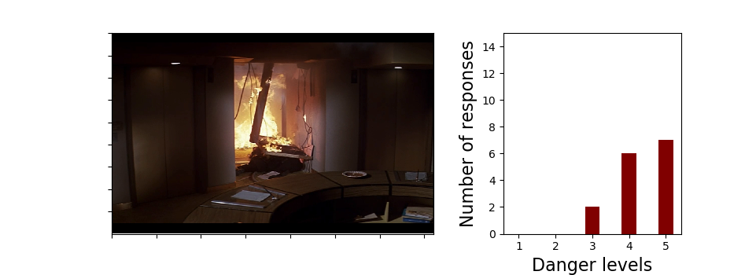 | ('fire', 5) <br> ('smoke', 3) <br> ('trapped', 3) <br> ('explosion', 4) <br> ('accident', 4)| 
| 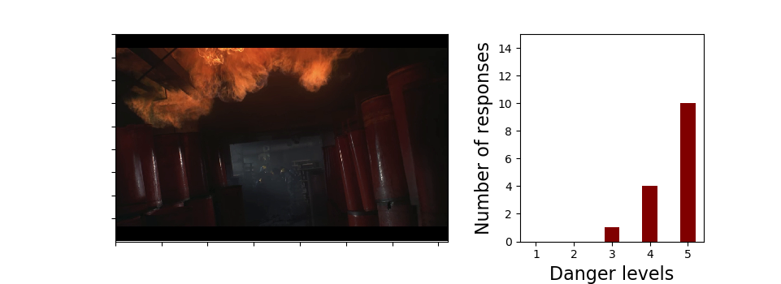 | ('dark', 5) <br> ('fire', 5) <br> ('trapped', 4) <br> ('smoke', 4) <br> ('heat', 5) | 
| 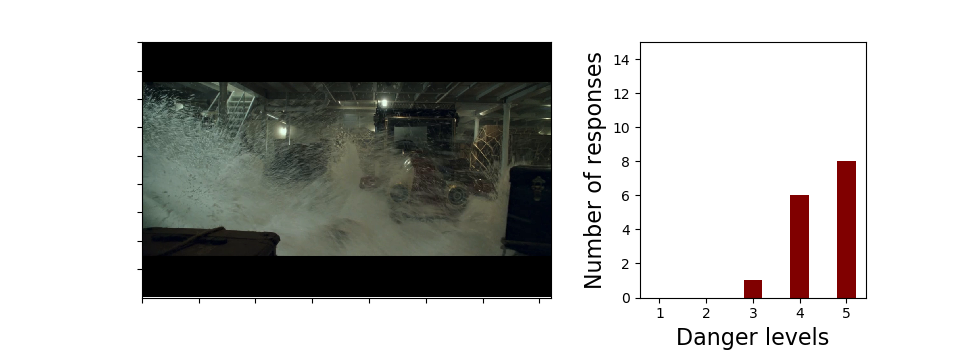 | ('flood', 5) <br>  ('cold', 5) <br> ('water', 4) <br> ('death', 5) <br> ('sinking', 4) | 
| 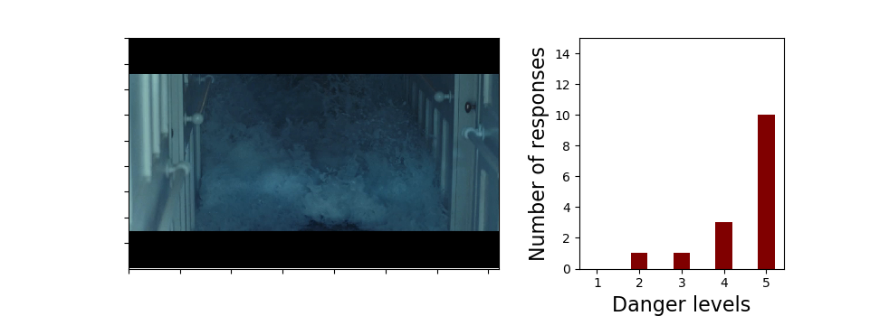 | ('water', 5) <br> ('damage', 5) <br> ('inundation', 5) <br>  ('ship', 5) <br> ('rush', 5) | 
| 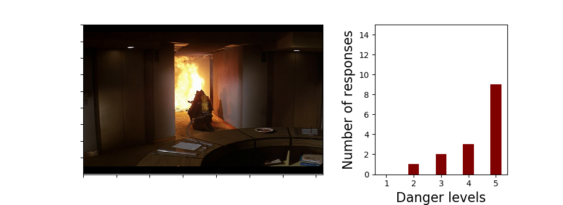 | ('smoke', 5) <br> ('heat', 5) <br> ('fire', 5) <br> ('accident', 4) <br> ('fireman', 5) | 
| 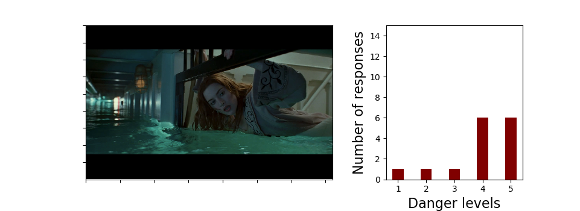 | ('drowning', 5) <br> ('ship', 5) <br> ('passanger', 5) <br> ('stuck', 4) <br>('water', 1) | 
| 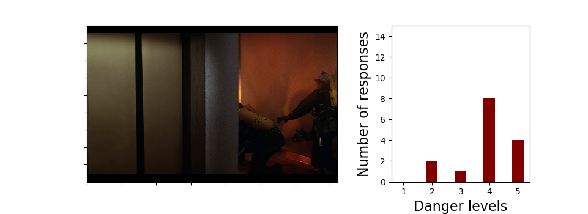 | ('smoke', 2) <br> ('smoke', 5) <br> ('burning', 4) <br> ('danger', 4) <br> ('elevator', 4) <br> ('firefighters', 4) | 
| 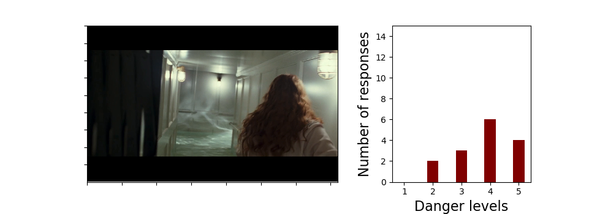 | ('soot', 4) <br> ('freeze', 5) <br> ('flood', 5) <br> ('boat', 4) <br> ('drown', 4) | 
| 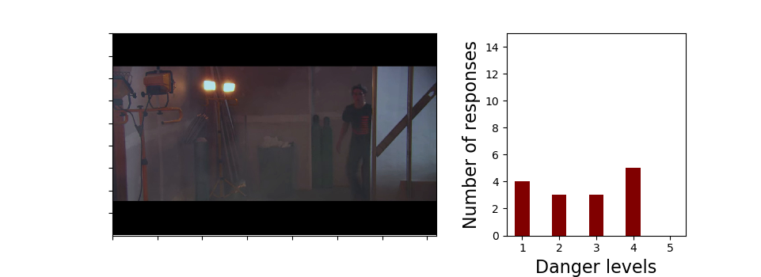 | ('dark', 3) <br> ('fumes', 2) <br> ('tripping', 1) <br> ('haze', 4) <br> ('damaged', 4) | 
| 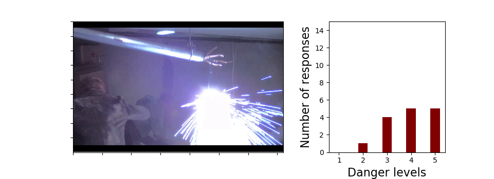 | ('unsafe', 5) <br> ('smoking', 3) <br> ('rubble', 5) <br> ('electricity', 5) <br> ('spark', 4) | 
| 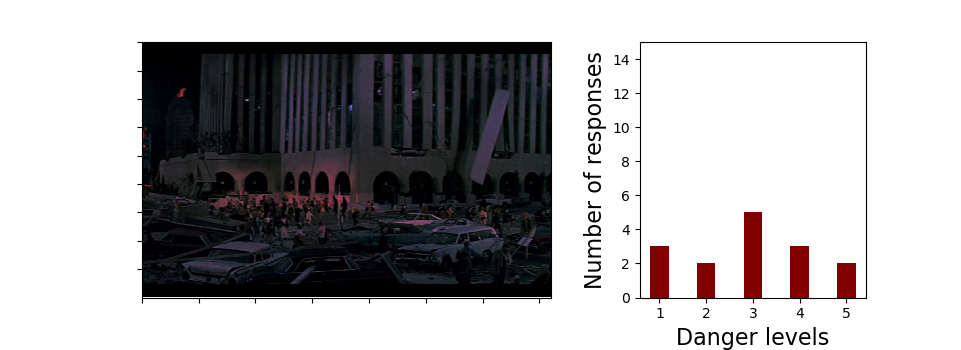 | ('dirty', 2)<br> ('lowlight', 1) <br> ('darkness', 2) <br> ('cracks', 3) <br> ('collapse', 5) | 
| 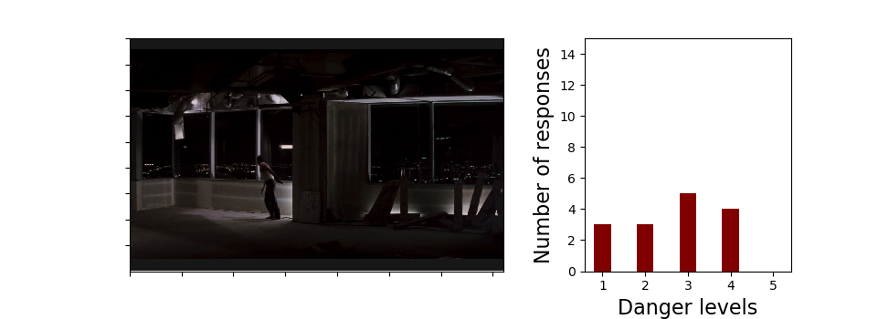 | ('darkness', 3) <br> ('smoke', 4) <br> ('gun', 4) <br> ('light', 2) <br> ('rubble', 1) | 
| 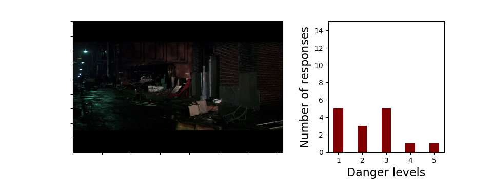 | ('mess', 1) <br> ('trash', 1) <br> ('wreckage', 2) <br> ('collapse', 3) <br>  ('accident', 3) | 
| 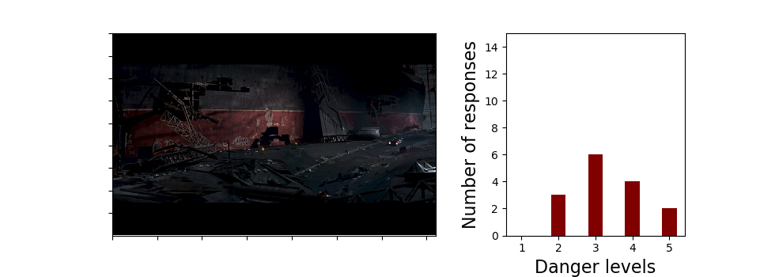 | ('broken', 2) <br> ('blast', 5) <br> ('waste', 5) <br> ('metal', 2) <br> ('wreckage', 3) | 
| 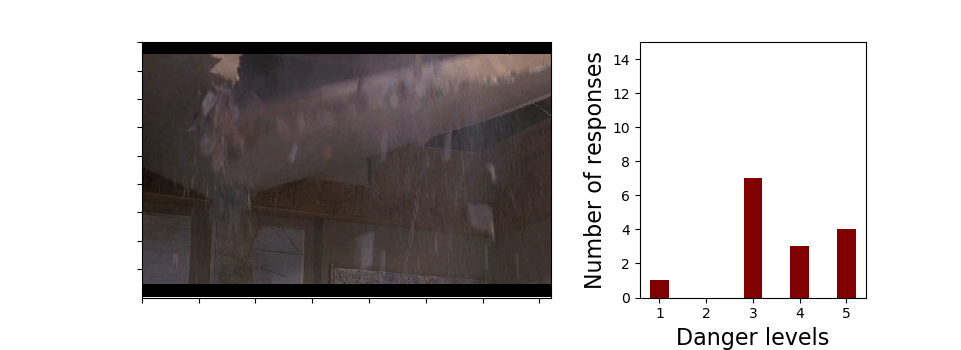 | ('disaster', 3) <br> ('falling', 3) <br> ('cracking', 3) <br> ('tremor', 3) <br> ('broken', 5) | 

|  | ('fire', 5) <br> ('smoke', 3) <br> ('trapped', 3) <br> ('explosion', 4) <br> ('accident', 4)| 
| 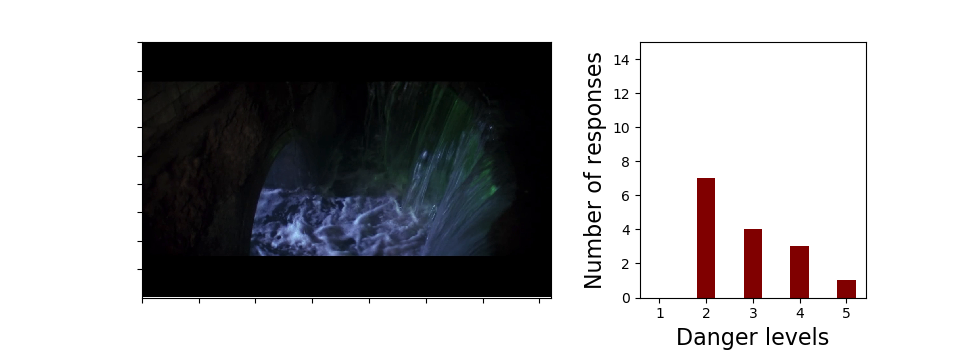 | ('dark', 5) <br> ('fire', 5) <br> ('trapped', 4) <br>  ('smoke', 4) <br> ('heat', 5) | 
| 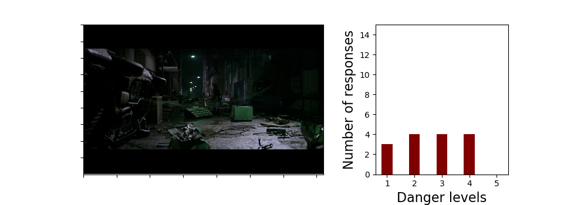 | ('fire', 5) <br> ('smoke', 3) <br> ('trapped', 3) <br> ('explosion', 4) <br> ('accident', 4)| 
| 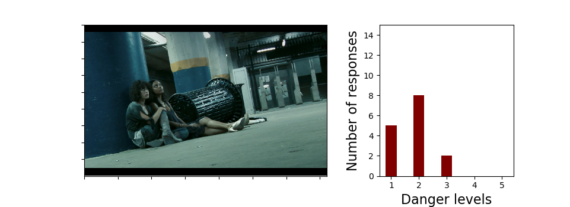 | ('dark', 5) <br> ('fire', 5) <br> ('trapped', 4) <br>  ('smoke', 4) <br> ('heat', 5) | 
| 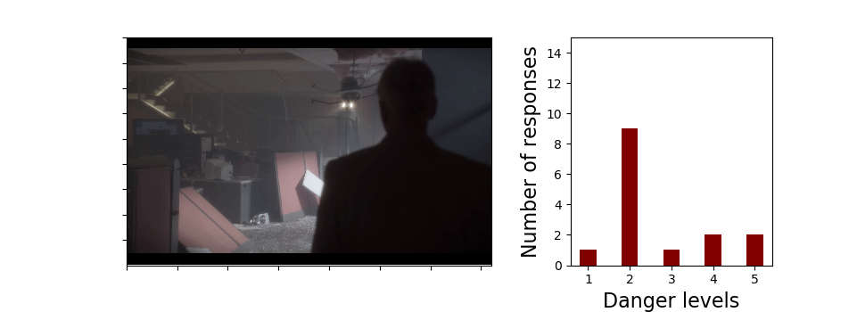 | ('fire', 5) <br> ('smoke', 3) <br> ('trapped', 3) <br> ('explosion', 4) <br> ('accident', 4)| 


| 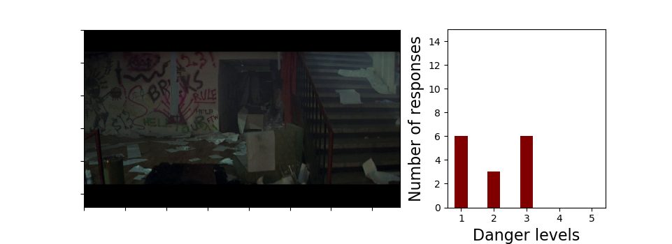 | ('fire', 5) <br> ('smoke', 3) <br> ('trapped', 3) <br> ('explosion', 4) <br> ('accident', 4)| 
| 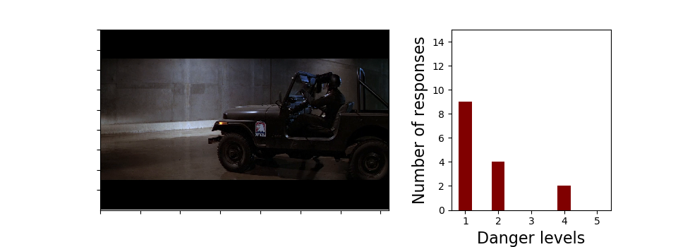 | ('dark', 5) <br> ('fire', 5) <br> ('trapped', 4) <br>  ('smoke', 4) <br> ('heat', 5) | 
| 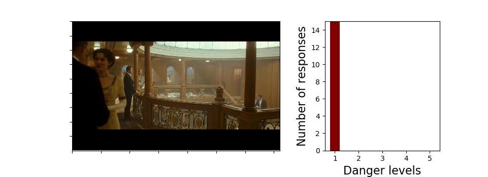 | ('fire', 5) <br> ('smoke', 3) <br> ('trapped', 3) <br> ('explosion', 4) <br> ('accident', 4)| 
| 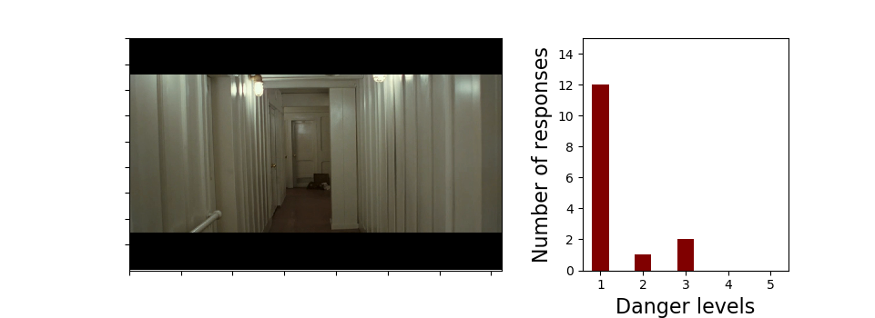 | ('dark', 5) <br> ('fire', 5) <br> ('trapped', 4) <br>  ('smoke', 4) <br> ('heat', 5) | 
| 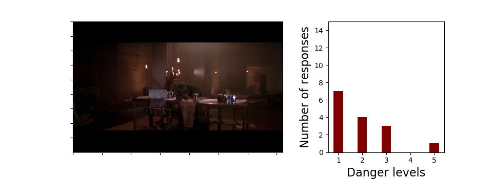 | ('fire', 5) <br> ('smoke', 3) <br> ('trapped', 3) <br> ('explosion', 4) <br> ('accident', 4)| 


## Contact
Vikram Shree ([vs476@cornell.edu](mailto:vs476@cornell.edu))
